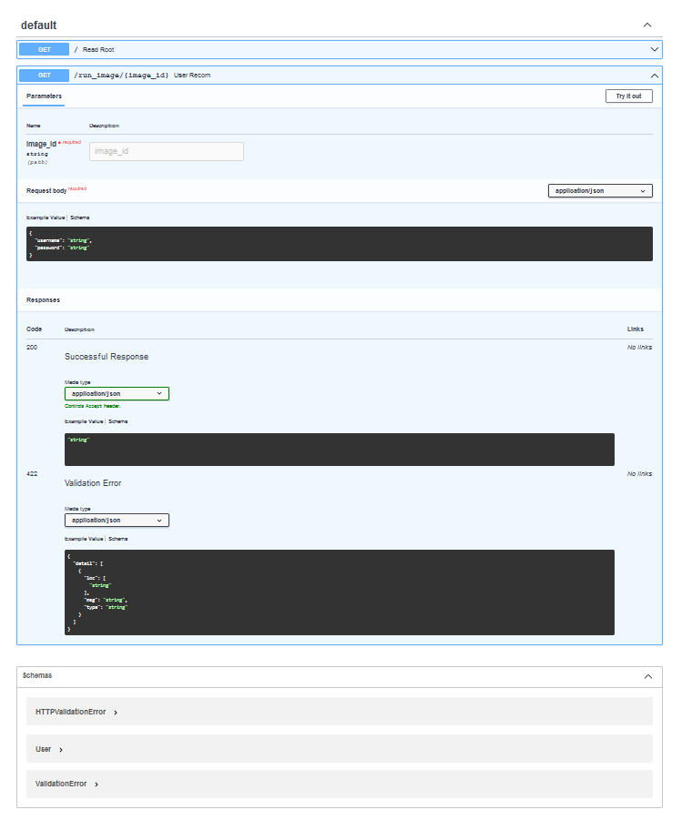
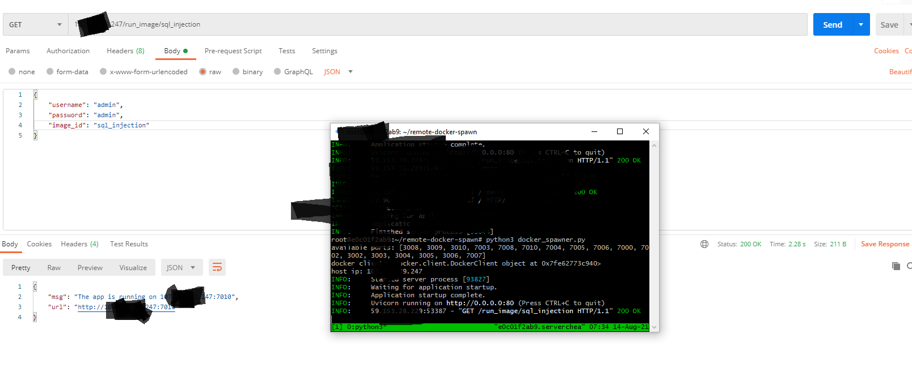

# remote-docker-spawn
Remotely spawning docker containers using REST API

### Installation

* `sudo apt update`

* `sudo apt install -y docker.io`

* `sudo apt install -y python3-dev python3-pip`

* `pip install -r requirements.txt`

### Documentation

1. Edit the `server_config.py` file with username, password, list of open ports, docker image ids, path to dockerfiles, etc.

2. Run the server, `python3 docker_spawner.py` (tmux)

3.  Make a request.

4. To add new Dockerfiles, add them inside project directory, add the paths to `server_config`, assign an `image_id`.

5. For client IPs, check out `ip_logger.txt`

  

### Postman

  

### Support 

- [x] Dockerfile

- [x] Client IP logging

- [x] Port assignment

- [ ] docker-compose

- [ ] DooD